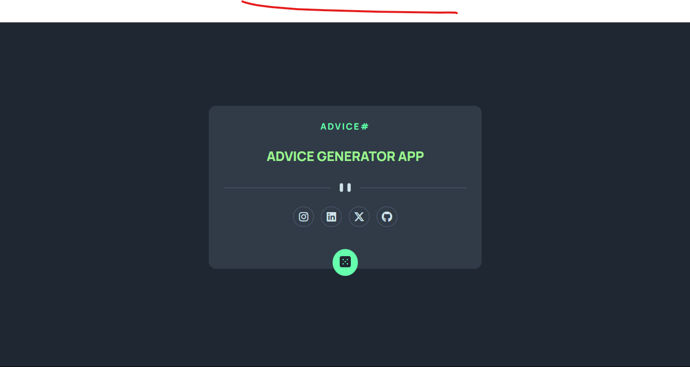

# Frontend - Advice generator app

### Desktop Result



# 📝 Descripción

> Este proyecto es una Aplicacion Generadora de Consejos totalmente funcional, todo se muestra de manera interactiva. Está diseñada para ser completamente responsive, con diseños adaptados tanto para móviles como para escritorio.

## ✨ Características principales

- **Diseño responsive:** Compatible con móviles y escritorio.

- **Diseño Flexbox:** Optimizado para una visualización perfecta en desktop y mobile.

- **Uso de JavaScript:** de Fetch para obtener la API que tiene los consejos y asi mostrarlos.

- **Visualización de la Pagina:** Cuenta con el numero del Consejo, El conesjo, Redes Solciales y el boton para generar el consejo.

## 🛠️ Tecnologías utilizadas

- **_HTML:_** Estructura semántica de la pagina.

- **_CSS:_** Estilos con Flexbox.

- **_JavaScript:_** Uso de Fetch para obtener los Consejos y asi mostralos en pantalla.

- **_Google Fonts:_** Fuente _Manrope_ para un diseño moderno.

- **_Git:_** Control de versiones.

## 🚀 Despliegue

> Este proyecto está desplegado en dos plataformas diferentes para que puedas acceder a él de manera fácil y rápida:

### 1. Netlify:

- El proyecto está alojado en Netlify, una plataforma moderna para aplicaciones web estáticas y dinámicas.

- Ver en Vivo: [Aqui](https://adviceegenerator-app.netlify.app/)

## 🚀 Instalación

Sigue estos sencillos pasos para ejecutar el proyecto en tu entorno local:

1. **Clona este repositorio**:
   Abre tu terminal y ejecuta el siguiente comando:

   ```bash
   git clone https://github.com/ImBenja/Frontend-Challenges.git

   ```

2. **Navega al directorio del proyecto**:

   ```bash
   cd Frontend-Challenges/Junior/Free/02-advice-generator-app-main

   ```

3. **Abre el archivo index.html en tu navegador**:
   Puedes hacerlo doble clic en el archivo o arrastrarlo a tu navegador.

## 👨‍💻 Autor

- **_Benjamin Juarez_**

<a href= "https://www.instagram.com/benjajuarez1_/?hl=es">
    
</a>
<a href="https://www.frontendmentor.io/profile/ImBenja">
  
</a>
<a href="https://x.com/benjajuarez_2">
   
</a>
<a href="https://www.linkedin.com/in/benjam%C3%ADn-ju%C3%A1rez-b712592b8/">
	
</a>
