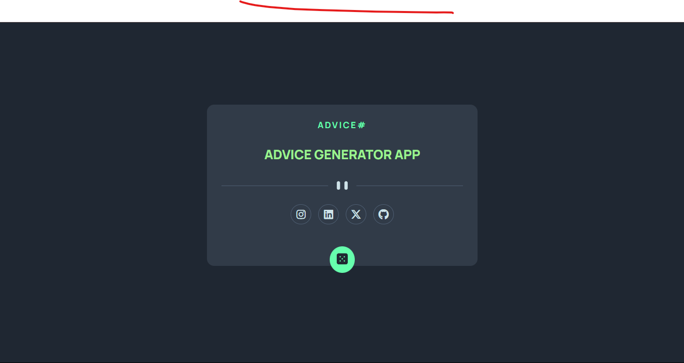

# Frontend Mentor - Advice generator app solution

> Esta es mi solución al desafío **Advice generator app solution** de Frontend Mentor. Los desafíos de Frontend Mentor te ayudan a mejorar tus habilidades de codificación mediante la construcción de proyectos realistas.

# 📖 Descripción general

### El desafío

Los usuarios deben poder:

1. Ver el diseño óptimo según el tamaño de pantalla de su dispositivo.

2. Ver los diseños.

3. Ver todos los consejos disponibles.

4. Ver el numero del consejo.

5. Ver cada Red Social.

### Screenshot

#### Vista de escritorio



**Descripción**: Esta son las captura de pantalla de mi solución al desafío **Advice generator app solution**. Muestra la vista de escritorio de el componente, con un diseño limpio.

### Links

- Solution URL: [**Solucion**](https://github.com/ImBenja/Frontend-Challenges/tree/main/Junior/Free/02-advice-generator-app-main)
- Live Site URL: [**Sitio en Vivo**](https://adviceegenerator-app.netlify.app/)

## 🛠️ Mi proceso

### Tecnologias utilizadas

- **_HTML:_** Estructura semántica de todo la APP.

- **_CSS:_** Estilos avanzados.

- **_JavaScript:_** Funcionalidad para mostrar el consejo y uso de Fetch para obtener los consejos.

- **_Google Fonts:_** Fuente Manrope para un diseño moderno.

### Lo que Aprendi

1. **Manejo de Fetch**: Uso de Fetch para obtener los consejos de la api.adviceslip.com, con el uso de Fetch se puede obtener los datos de la api y mostrarlos en la APP.

2. **Mostrar el consejo**: Aprendí a mostrar el consejo utilizando JavaScript.

```js
const adviceId = document.querySelector(".advice__id");
const adviveText = document.querySelector(".text__advice");
const btn = document.querySelector(".btn__advice");

function getAdvice() {
  fetch("https://api.adviceslip.com/advice")
    .then((res) => {
      if (!res.ok) {
        throw new Error("Something went wrong");
      }
      return res.json();
    })
    .then((data) => {
      adviceId.textContent = ` #${data.slip.id}`;
      adviveText.textContent = `"${data.slip.advice}"`;
      adviveText.style.color = "hsl(193, 38%, 86%)";
    })
    .catch((err) => {
      adviveText.textContent = err.message;
    });
}

btn.addEventListener("click", getAdvice);
```

## 👨‍💻 Autor

- GitHub - [ImBenja](https://github.com/ImBenja)
- Frontend Mentor - [@ImBenja](https://www.frontendmentor.io/profile/ImBenja)
- Instagram - [@benjajuarez1\_](https://www.instagram.com/benjajuarez1_/?hl=es)
- Twitter - [@benjajuarez_2](https://x.com/benjajuarez_2)
- Linkedin - [Benjamim Juarez](https://www.linkedin.com/in/benjam%C3%ADn-ju%C3%A1rez-b712592b8/)

## 🙏 Agradecimientos

> Agradezco a Frontend Mentor por proporcionar este desafío y a la comunidad por su apoyo y feedback.
