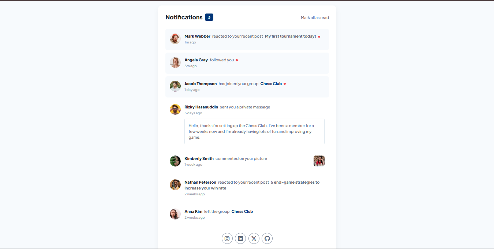

# Frontend Mentor - Notifications page solution

> Esta es mi solución al desafío **Notifications page solution** de Frontend Mentor. Los desafíos de Frontend Mentor te ayudan a mejorar tus habilidades de codificación mediante la construcción de proyectos realistas.

# 📖 Descripción general

### El desafío

Los usuarios deben poder:

1. Ver el diseño óptimo según el tamaño de pantalla de su dispositivo.

2. Ver los diseños de cada notificacion.

3. Ver las notificaciones recientes.

4. Leer todas las notificaciones no leidas.

5. Ver el contenido y el contexto de la notificacion.

6. Ver el perfil de quien hizo la notificacion.

### Screenshot

#### Vista de escritorio

**Descripción**: Esta son las captura de pantalla de mi solución al desafío **Notifications page solution**. Muestra la vista de escritorio de el componente, con un diseño limpio.

### Links

- Solution URL: [**Solucion**](https://github.com/ImBenja/Frontend-Challenges/tree/main/Junior/Free/03-notifications-page-main)
- Live Site URL: [**Sitio en Vivo**](https://notificationss-page.netlify.app/)

## 🛠️ Mi proceso

### Tecnologias utilizadas

- **_HTML:_** Estructura semántica de toda la bandeja de notificaciones.

- **_CSS:_** Estilos avanzados para cada notificacion.

- **_JavaScript:_** Funcionalidad para leer todas las notificaciones no leidas.

- **_Google Fonts:_** Fuente Plus Jakarta Sans para un diseño moderno.

## 👨‍💻 Autor

- GitHub - [ImBenja](https://github.com/ImBenja)
- Frontend Mentor - [@ImBenja](https://www.frontendmentor.io/profile/ImBenja)
- Instagram - [@benjajuarez1\_](https://www.instagram.com/benjajuarez1_/?hl=es)
- Twitter - [@benjajuarez_2](https://x.com/benjajuarez_2)
- Linkedin - [Benjamim Juarez](https://www.linkedin.com/in/benjam%C3%ADn-ju%C3%A1rez-b712592b8/)

## 🙏 Agradecimientos

> Agradezco a Frontend Mentor por proporcionar este desafío y a la comunidad por su apoyo y feedback.
