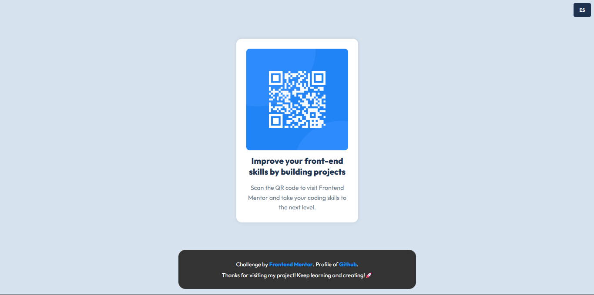
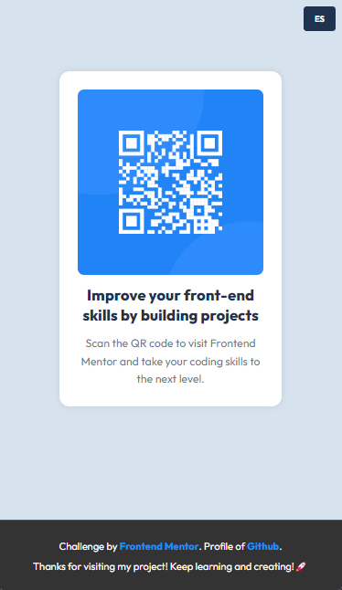

# Frontend Mentor - QR code component solution

> Esta es mi solución al desafío QR Code Component de Frontend Mentor. Los desafíos de Frontend Mentor te ayudan a mejorar tus habilidades de codificación mediante la construcción de proyectos realistas.

## 📚 Tabla de contenidos

- [Descripción general](#Descripción-general)
  - [El desafío](#the-challenge)
  - [Captura de pantalla](#screenshot)
  - [Enlaces](#links)
- [Mi proceso](#my-process)
  - [Tecnologías utilizadas](#built-with)
  - [Lo que aprendí](#what-i-learned)
  - [Desarrollo futuro](#continued-development)
  - [Recursos útiles](#useful-resources)
- [Autor](#author)
- [Agradecimientos](#acknowledgments)

# 📖 Descripción general

### El desafío

Los usuarios deben poder:

1. Ver el diseño óptimo según el tamaño de pantalla de su dispositivo.

2. Alternar el idioma del sitio de forma dinámica.

3. Ver los diseños de Flexbox y los efectos de hover.

> **Bonus:** Use datos de dos archivos .JSON para alternar un cambio de idiomas ya sea Español o Ingles.

### Screenshot

#### Vista de escritorio



#### Vista móvil



**Descripción**: Esta son las captura de pantalla de mi solución al desafío **Blog Preview Card Component**. Muestra la vista de escritorio del componente, con un diseño limpio. Muestra la vista de mobile del componente, con un diseño responsive en todos los dispositivos

### Links

- Solution URL: [**Solucion**](https://github.com/ImBenja/Frontend-Challenges/tree/main/Newbie/Free-Plus/02-qr-code-component-main)
- Live Site URL: [**Sitio en Vivo**](https://component-qr-preview.netlify.app/)

## 🛠️ Mi proceso

### Tecnologias utilizadas

- **_HTML:_** Estructura semántica del componente.

- **_CSS:_** Estilos avanzados con Flexbox y hovers interactivos.

- **_JavaScript:_** Uso de Fetch API para cargar los idiomas y evento de click para cambiar el idioma a Ingles o Español.

- **_Google Fonts:_** Fuente Outfit para un diseño moderno.

## Lo que Aprendi

1. _Diseño responsive: Usé media queries y un enfoque mobile-first para adaptar el diseño a diferentes dispositivos._

2. _Manipulación del DOM: Aprendí a cargar datos dinámicos desde dos archivo JSON para alternar entre ingles o español._

3. _Uso de IMPORTS:\_ Uso de la palabra reservada IMPORT para importar los datos de los archivos JSON._

```js
// main.js
import {
  loadTranslations,
  toggleLanguage,
  updateContent,
} from "./components/languaje.js";

document.addEventListener("DOMContentLoaded", () => {
  loadTranslations();

  // Botón de cambio de idioma
  const langBtn = document.getElementById("langBtn");
  langBtn.addEventListener("click", toggleLanguage);
});
```

```js
// language.js
import { category, publication, title, description } from "../util/const.js";

let currentLang = "en";
let translations = {};

export async function loadTranslations() {
  console.log("Intentando cargar:", window.location.origin + "/en.json");
  console.log("Intentando cargar:", window.location.origin + "/es.json");

  try {
    const [enResponse, esResponse] = await Promise.all([
      fetch("assets/locales/en.json"),
      fetch("assets/locales/es.json"),
    ]);

    translations = {
      en: await enResponse.json(),
      es: await esResponse.json(),
    };

    updateContent();
  } catch (error) {
    console.error("Error loading translations:", error);
  }
}

export function toggleLanguage() {
  currentLang = currentLang === "en" ? "es" : "en";
  const btn = document.getElementById("langBtn");
  btn.textContent = currentLang === "en" ? "ES" : "EN";
  setTimeout(() => {
    updateContent();
  }, 200);
}

export function updateContent() {
  const t = translations[currentLang];
  if (!t) return;

  category.textContent = t.category;
  publication.textContent = t.publicationDate;
  title.textContent = t.title;
  description.textContent = t.description;
  document.querySelector(".text-links").innerHTML = t.footerLinks;
  document.querySelector(".text-saludo").innerHTML = t.footerSaludo;
}
```

## 👨‍💻 Autor

- GitHub - [ImBenja](https://github.com/ImBenja)
- Frontend Mentor - [@ImBenja](https://www.frontendmentor.io/profile/ImBenja)
- Instagram - [@benjajuarez1\_](https://www.instagram.com/benjajuarez1_/?hl=es)
- Twitter - [@benjajuarez_2](https://x.com/benjajuarez_2)
- Linkedin - [Benjamim Juarez](https://www.linkedin.com/in/benjam%C3%ADn-ju%C3%A1rez-b712592b8/)

## 🙏 Agradecimientos

> Agradezco a Frontend Mentor por proporcionar este desafío y a la comunidad por su apoyo y feedback.
