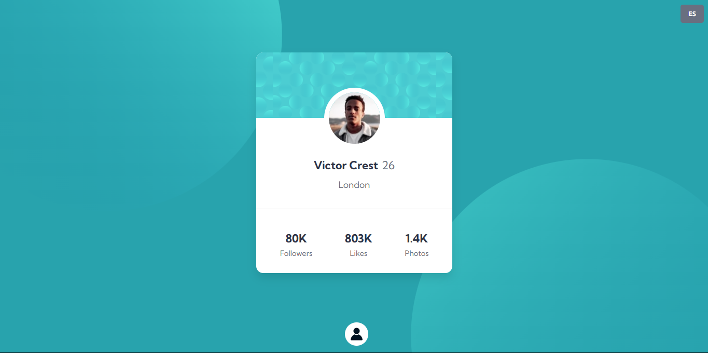

# Frontend Mentor - Profile card component solution

> Esta es mi solución al desafío Profile card component solution de Frontend Mentor. Los desafíos de Frontend Mentor te ayudan a mejorar tus habilidades de codificación mediante la construcción de proyectos realistas.

## 📚 Tabla de contenidos

- [Descripción general](#Descripción-general)
  - [El desafío](#the-challenge)
  - [Captura de pantalla](#screenshot)
  - [Enlaces](#links)
- [Mi proceso](#my-process)
  - [Tecnologías utilizadas](#built-with)
  - [Lo que aprendí](#what-i-learned)
  - [Desarrollo futuro](#continued-development)
  - [Recursos útiles](#useful-resources)
- [Autor](#author)
- [Agradecimientos](#acknowledgments)

# 📖 Descripción general

### El desafío

Los usuarios deben poder:

1. Ver el diseño óptimo según el tamaño de pantalla de su dispositivo.

2. Ver los datos dinamicamente almacenados en el archivo data.json

3. Ver los diseños de Flexbox y los efectos de hover.

> **Bonus:** Use datos de dos archivos .JSON para alternar un cambio de idiomas ya sea Español o Ingles.

### Screenshot

#### Vista de escritorio



#### Vista móvil


**Descripción**: Esta son las captura de pantalla de mi solución al desafío **Social links profile**. Muestra la vista de escritorio del componente, con un diseño limpio. Muestra la vista de mobile del componente, con un diseño responsive en todos los dispositivos.

### Links

- Solution URL: [**Solucion**](https://github.com/ImBenja/Frontend-Challenges/tree/main/Newbie/Free/05-profile-card-component-main)
- Live Site URL: [**Sitio en Vivo**](https://profile-componentr.netlify.app/)

## 🛠️ Mi proceso

### Tecnologias utilizadas

- **_HTML:_** Estructura semántica del componente.

- **_CSS:_** Estilos avanzados con Flexbox y hovers interactivos.

- **_JavaScript:_** Uso de Fetch API para cargar los idiomas y evento de click para cambiar el idioma a Ingles o Español.
  Ademas cargamos los datos dinamicamente.

- **_Google Fonts:_** Fuente Kumbh Sans para un diseño moderno.

### Lo que Aprendi

1. _Diseño responsive: Usé media queries y un enfoque mobile-first para adaptar el diseño a diferentes dispositivos._

2. _Manipulación del DOM: Aprendi a manipular el DOM para cargar los datos dinámicos desde un archivo JSON._

3. _Cambio de idioma: aprendi a altenar el idioma al hacer click en un boton._

```html
<figure class="card__content--image"></figure>
<div class="card__content--nameage">
  <h1 class="card__content--name"></h1>
  <span class="card__content--age"></span>
</div>
<p class="card__content--city"></p>
<hr />
<section class="card__content--stats">
  <article class="card__content--info--stats">
    <h2 class="card__content--info--stats--number followers"></h2>
    <p class="card__content--info--stats--text followers">Followers</p>
  </article>
  <article class="card__content--info--stats">
    <h2 class="card__content--info--stats--number likes"></h2>
    <p class="card__content--info--stats--text likes">Likes</p>
  </article>
  <article class="card__content--info--stats">
    <h2 class="card__content--info--stats--number photos"></h2>
    <p class="card__content--info--stats--text photos">Photos</p>
  </article>
</section>
```

```js
// main.js
import { loadData } from "./components/data.js";
import { loadTranslations, toggleLanguage } from "./components/languaje.js";
document.addEventListener("DOMContentLoaded", () => {
  loadData();
  loadTranslations();

  // Botón de cambio de idioma
  const langBtn = document.getElementById("langBtn");
  langBtn.addEventListener("click", toggleLanguage);
});

const menuBtn = document.querySelector("#attribution-btn");
const menu = document.querySelector("#attribution-menu");
menu.classList.remove("attribution-menu--active");

menuBtn.addEventListener("click", () => {
  menu.classList.toggle("attribution-menu--active");
});
```

## 👨‍💻 Autor

- GitHub - [ImBenja](https://github.com/ImBenja)
- Frontend Mentor - [@ImBenja](https://www.frontendmentor.io/profile/ImBenja)
- Instagram - [@benjajuarez1\_](https://www.instagram.com/benjajuarez1_/?hl=es)
- Twitter - [@benjajuarez_2](https://x.com/benjajuarez_2)
- Linkedin - [Benjamim Juarez](https://www.linkedin.com/in/benjam%C3%ADn-ju%C3%A1rez-b712592b8/)

## 🙏 Agradecimientos

> Agradezco a Frontend Mentor por proporcionar este desafío y a la comunidad por su apoyo y feedback.
