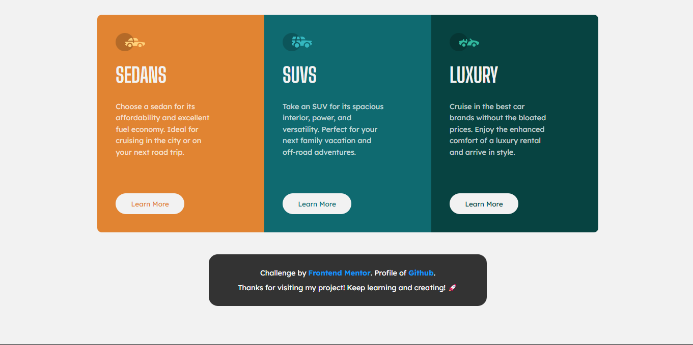

# Frontend Mentor - 3-column preview card component solution

> Esta es mi solución al desafío 3-column preview card component solution de Frontend Mentor. Los desafíos de Frontend Mentor te ayudan a mejorar tus habilidades de codificación mediante la construcción de proyectos realistas.

## 📚 Tabla de contenidos

- [Descripción general](#Descripción-general)
  - [El desafío](#the-challenge)
  - [Captura de pantalla](#screenshot)
  - [Enlaces](#links)
- [Mi proceso](#my-process)
  - [Tecnologías utilizadas](#built-with)
  - [Lo que aprendí](#what-i-learned)
  - [Desarrollo futuro](#continued-development)
  - [Recursos útiles](#useful-resources)
- [Autor](#author)
- [Agradecimientos](#acknowledgments)

# 📖 Descripción general

### El desafío

Los usuarios deben poder:

1. Ver el diseño óptimo según el tamaño de pantalla de su dispositivo.

2. Ver los datos dinamicamente almacenados en el archivo data.json.

3. Ver los diseños de Flexbox y los efectos de hover.

### Screenshot

#### Vista de escritorio



#### Vista móvil


**Descripción**: Esta son las captura de pantalla de mi solución al desafío **3-column preview card component solution**. Muestra la vista de escritorio del componente, con un diseño limpio. Muestra la vista de mobile del componente, con un diseño responsive en todos los dispositivos.

### Links

- Solution URL: [**Solucion**](https://github.com/ImBenja/Frontend-Challenges/tree/main/Newbie/Free/09-3-column-preview-card-component-main)
- Live Site URL: [**Sitio en Vivo**](https://components-cars-preview.netlify.app/)

## 🛠️ Mi proceso

### Tecnologias utilizadas

- **_HTML:_** Estructura semántica del componente.

- **_CSS:_** Estilos avanzados con Flexbox.

- **_JavaScript:_** Uso de Fetch API para cargar los datos Dinamicamente.

- **_Google Fonts:_** Fuente Big Shoulders Display y Lexend Deca para un diseño moderno.

### Lo que Aprendi

1. _Diseño responsive: Usé media queries y un enfoque mobile-first para adaptar el diseño a diferentes dispositivos._

2. _Manipulación del DOM: Aprendi a cargar los datos dinamicamente mediante un bucle For._

```html
<main class="container">
  <section class="card sedans">
    <figure class="card__image sedans"></figure>
    <article class="card__content">
      <h1 class="card__title"></h1>
      <p class="card__description"></p>
      <button class="card__btn sedans">Learn More</button>
    </article>
  </section>
  <section class="card suvs">
    <figure class="card__image suvs"></figure>
    <article class="card__content">
      <h1 class="card__title"></h1>
      <p class="card__description"></p>
      <button class="card__btn suvs">Learn More</button>
    </article>
  </section>
  <section class="card luxury">
    <figure class="card__image luxury"></figure>
    <article class="card__content">
      <h1 class="card__title"></h1>
      <p class="card__description"></p>
      <button class="card__btn luxury">Learn More</button>
    </article>
  </section>
</main>
```

```js
// data.js
const title = document.querySelectorAll(".card__title");
const description = document.querySelectorAll(".card__description");
const icon = document.querySelectorAll(".card__image");

export function loadData() {
  fetch("assets/locales/data.json")
    .then((res) => {
      if (!res.ok) {
        throw new Error("Failed to fetch data");
      }
      return res.json();
    })
    .then((data) => {
      for (let i = 0; i < title.length; i++) {
        title[i].innerHTML = data[i].title;
        description[i].innerHTML = data[i].description;
        const img = document.createElement("img");
        img.src = data[i].icon;
        img.alt = data[i].title;
        icon[i].appendChild(img);
      }
    })
    .catch((error) => {
      console.error(error);
    });
}
```

## 👨‍💻 Autor

- GitHub - [ImBenja](https://github.com/ImBenja)
- Frontend Mentor - [@ImBenja](https://www.frontendmentor.io/profile/ImBenja)
- Instagram - [@benjajuarez1\_](https://www.instagram.com/benjajuarez1_/?hl=es)
- Twitter - [@benjajuarez_2](https://x.com/benjajuarez_2)
- Linkedin - [Benjamim Juarez](https://www.linkedin.com/in/benjam%C3%ADn-ju%C3%A1rez-b712592b8/)

## 🙏 Agradecimientos

> Agradezco a Frontend Mentor por proporcionar este desafío y a la comunidad por su apoyo y feedback.
