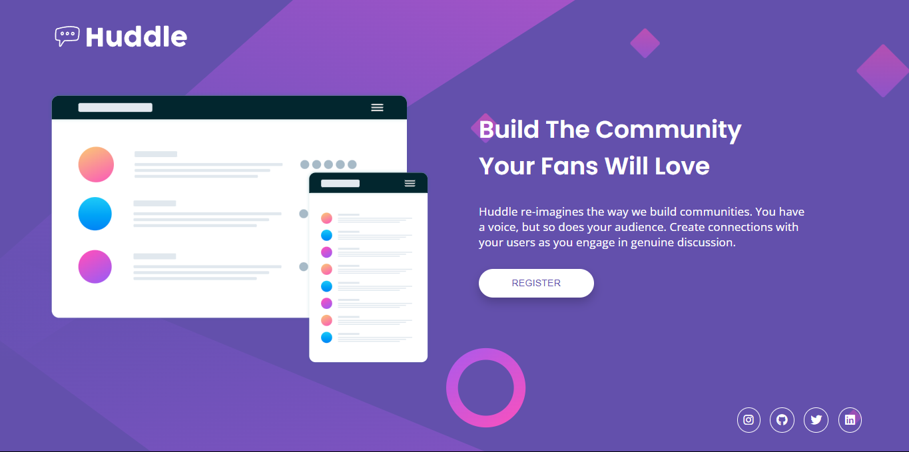
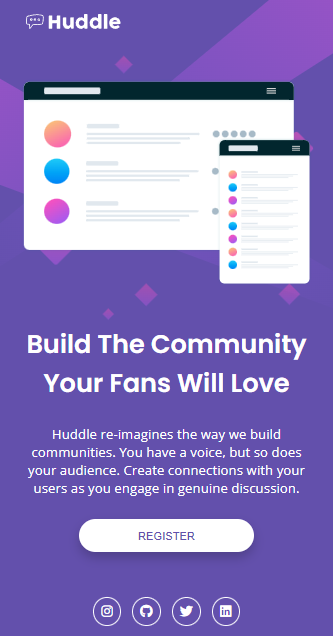

# Frontend Mentor - Huddle landing page with single introductory section solution

> Esta es mi solución al desafío Huddle Landing Page Solution de Frontend Mentor. Los desafíos de Frontend Mentor te ayudan a mejorar tus habilidades de codificación mediante la construcción de proyectos realistas.

## 📚 Tabla de contenidos

- [Descripción general](#Descripción-general)
  - [El desafío](#the-challenge)
  - [Captura de pantalla](#screenshot)
  - [Enlaces](#links)
- [Mi proceso](#my-process)
  - [Tecnologías utilizadas](#built-with)
  - [Lo que aprendí](#what-i-learned)
  - [Desarrollo futuro](#continued-development)
  - [Recursos útiles](#useful-resources)
- [Autor](#author)
- [Agradecimientos](#acknowledgments)

# 📖 Descripción general

### El desafío

Los usuarios deben poder:

1. Ver el diseño óptimo según el tamaño de pantalla de su dispositivo.

2. Ver la Landing Page con toda su informacion y redes sociales.

3. Ver los diseños de Flexbox y los efectos de hover.

### Screenshot

#### Vista de escritorio



#### Vista móvil



**Descripción**: Esta son las captura de pantalla de mi solución al desafío **Huddle Landing Page Solution**. Muestra la vista de escritorio de la Landing Page, con un diseño limpio. Muestra la vista de mobile de la Landing Page, con un diseño responsive en todos los dispositivos.

### Links

- Solution URL: [**Solucion**](https://github.com/ImBenja/Frontend-Challenges/tree/main/Newbie/Free/09-3-column-preview-card-component-main)
- Live Site URL: [**Sitio en Vivo**](https://huddle-landing-page-information.netlify.app/)

## 🛠️ Mi proceso

### Tecnologias utilizadas

- **_HTML:_** Estructura semántica de la Landing Page.

- **_CSS:_** Estilos avanzados con Flexbox.

- **_Google Fonts:_** Fuente Open Sans y Poppins para un diseño moderno.

### Lo que Aprendi

1. _Diseño responsive: Usé media queries y un enfoque mobile-first para adaptar el diseño a diferentes dispositivos._
2. _Diseño Flexbox: Usé Flexbox para crear un diseño moderno y atractivo._

3. _Visualización de resultados: Usé fondos con colores modernos y atractivos para mostrar los resultados de manera efectiva._

```html
<body>
  <header>
    <figure class="header__image">
      
    </figure>
  </header>
  <main>
    <figure class="container__image">
      
    </figure>
    <article class="container__content">
      <h1 class="container__title">Build The Community Your Fans Will Love</h1>
      <p class="container__paragraph">
        Huddle re-imagines the way we build communities. You have a voice, but
        so does your audience. Create connections with your users as you engage
        in genuine discussion.
      </p>
      <button class="container__button">Register</button>
    </article>
  </main>
  <footer>
    <section class="container">
      <a href="https://www.instagram.com/benjajuarez1_/?hl=es"
        ><i class="fa-brands fa-instagram"></i
      ></a>
      <a href="https://github.com/ImBenja"
        ><i class="fa-brands fa-github"></i
      ></a>
      <a href="https://x.com/benjajuarez_2"
        ><i class="fa-brands fa-twitter"></i
      ></a>
      <a href="https://www.linkedin.com/in/benjam%C3%ADn-ju%C3%A1rez-b712592b8/"
        ><i class="fa-brands fa-linkedin"></i
      ></a>
    </section>
  </footer>
</body>
```

## 👨‍💻 Autor

- GitHub - [ImBenja](https://github.com/ImBenja)
- Frontend Mentor - [@ImBenja](https://www.frontendmentor.io/profile/ImBenja)
- Instagram - [@benjajuarez1\_](https://www.instagram.com/benjajuarez1_/?hl=es)
- Twitter - [@benjajuarez_2](https://x.com/benjajuarez_2)
- Linkedin - [Benjamim Juarez](https://www.linkedin.com/in/benjam%C3%ADn-ju%C3%A1rez-b712592b8/)

## 🙏 Agradecimientos

> Agradezco a Frontend Mentor por proporcionar este desafío y a la comunidad por su apoyo y feedback.
