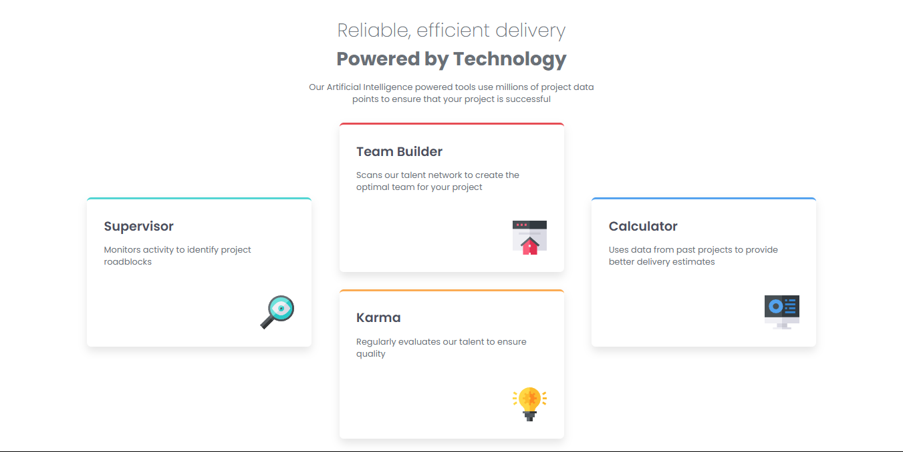
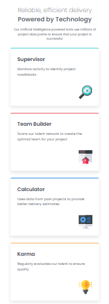

# Four card feature section

### Desktop Result



# 📝 Descripción

> Este proyecto es un componente que muestra informacion en 4 tarjetas sobre entregas Confiables y Eficientes Impulsadas por la tecnologia de manera interactiva y visualmente atractiva. Está diseñado para ser completamente responsive, con diseños adaptados tanto para móviles como para escritorio. Ademas, utiliza un diseño Flexbox para una visualizacion perfecta tanto como en mobile como en desktop.

## ✨ Características principales

- **Diseño responsive:** Compatible con móviles y escritorio.

- **Diseño Flexbox:** Optimizado para una visualización perfecta en desktop y mobile.

- **Visualización de Tarjetas:** Cuenta con un Titulo, una Descripcion y una imagen.

## 🛠️ Tecnologías utilizadas

- **_HTML:_** Estructura semántica de la seccion.

- **_CSS:_** Estilos avanzados con Flexbox.

- **_Google Fonts:_** Fuente _Poppins_ para un diseño moderno.

## 🚀 Despliegue

> Este proyecto está desplegado en dos plataformas diferentes para que puedas acceder a él de manera fácil y rápida:

### 1. Netlify:

- El proyecto está alojado en Netlify, una plataforma moderna para aplicaciones web estáticas y dinámicas.

- Ver en Vivo: [Aqui](https://reliablefour-cards.netlify.app/)

## 🚀 Instalación

Sigue estos sencillos pasos para ejecutar el proyecto en tu entorno local:

1. **Clona este repositorio**:
   Abre tu terminal y ejecuta el siguiente comando:

   ```bash
   git clone https://github.com/ImBenja/Frontend-Challenges.git

   ```

2. **Navega al directorio del proyecto**:

   ```bash
   cd Frontend-Challenges/Newbie/Free/13-four-card-feature-section-master

   ```

3. **Abre el archivo index.html en tu navegador**:
   Puedes hacerlo doble clic en el archivo o arrastrarlo a tu navegador.

## 💻 Uso

El componente funciona de la siguiente manera:

1. HTML y CSS PURO.

2. Muestra la introcuccion en formato Tarjetas.

3. Se adapta automáticamente a diferentes tamaños de pantalla.

<table border="1">
  <tr>
    <th>
      Mobile View
    </th>
  </tr>
  <tr>
    <td>
    
    </td>
  </tr>
  <tr>
     <th>
      Desktop View
    </th>
  </tr>
  <tr>
     <td>
      
    </td>
  </tr>
</table>

## 👨‍💻 Autor

- **_Benjamin Juarez_**

<a href= "https://www.instagram.com/benjajuarez1_/?hl=es">
    
</a>
<a href="https://www.frontendmentor.io/profile/ImBenja">
  
</a>
<a href="https://x.com/benjajuarez_2">
   
</a>
<a href="https://www.linkedin.com/in/benjam%C3%ADn-ju%C3%A1rez-b712592b8/">
	
</a>
