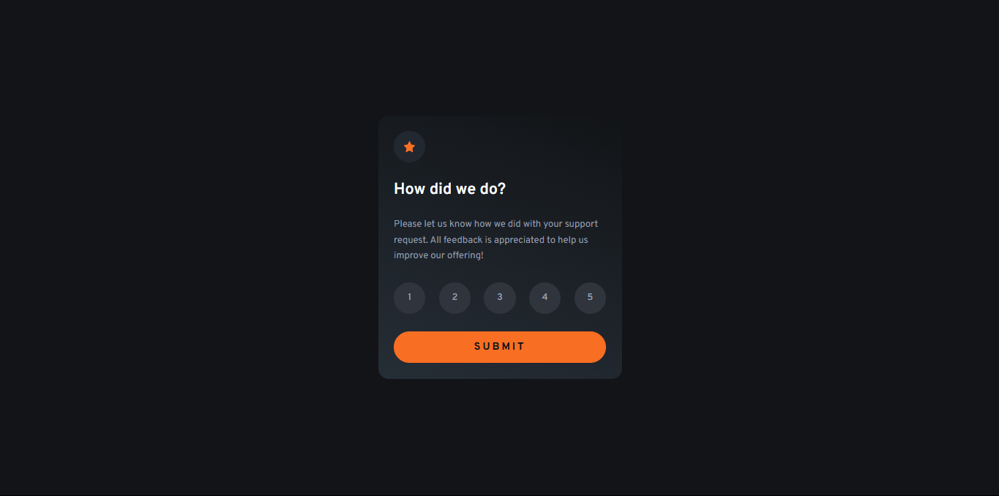

# Interactive rating component

### Desktop Result



### Desktop Active Result


# 📝 Descripción

> Este proyecto es un componente donde se le otorga al usuario una tarjeta para hacer una reseña respecto con la solicitud del reporte, todo se muestra de manera interactiva y visualmente atractiva. Está diseñado para ser completamente responsive, con diseños adaptados tanto para móviles como para escritorio.

## ✨ Características principales

- **Diseño responsive:** Compatible con móviles y escritorio.

- **Diseño Flexbox:** Optimizado para una visualización perfecta en desktop y mobile.

- **Uso de JavaScript:** Utiliza JavaScript para agregar interactividad a la pagina.

- **Visualización del Componente:** Cuenta con un titulo, una descripcion, 5 botones para evaluar la reseña y un boton para enviarla. Tambien cuenta con un boton para volver a enviar la reseña.

- **Mensaje de Error:** Si el usuario no selecciona ninguna opcion, se muestra un mensaje de error.

## 🛠️ Tecnologías utilizadas

- **_HTML:_** Estructura semántica del componente.

- **_CSS:_** Estilos con Flexbox.

- **_JavaScript:_** Agrega interactividad a toda la pagina.

- **_Google Fonts:_** Fuente _Overpass_ para un diseño moderno.

## 🚀 Despliegue

> Este proyecto está desplegado en dos plataformas diferentes para que puedas acceder a él de manera fácil y rápida:

### 1. Netlify:

- El proyecto está alojado en Netlify, una plataforma moderna para aplicaciones web estáticas y dinámicas.

- Ver en Vivo: [Aqui](https://interactive-ratinggg.netlify.app/)

## 🚀 Instalación

Sigue estos sencillos pasos para ejecutar el proyecto en tu entorno local:

1. **Clona este repositorio**:
   Abre tu terminal y ejecuta el siguiente comando:

   ```bash
   git clone https://github.com/ImBenja/Frontend-Challenges.git

   ```

2. **Navega al directorio del proyecto**:

   ```bash
   cd Frontend-Challenges/Newbie/Free/15-interactive-rating-component-main

   ```

3. **Abre el archivo index.html en tu navegador**:
   Puedes hacerlo doble clic en el archivo o arrastrarlo a tu navegador.

## 💻 Uso

El componente funciona de la siguiente manera:

1. HTML, CSS y JavaScript.

2. Muestra la informacion en formato Tarjeta.

3. Se adapta automáticamente a diferentes tamaños de pantalla.

4. Interactivo con los botones de reseña.

5. Visualiza el resultado de la reseña.

6. Puedes volver a enviar la reseña.

## 📷 Resultados

<table border="1">
  <tr>
     <th>
      Desktop View
    </th>
  </tr>
  <tr>
     <td>
      
    </td>
  </tr>
</table>

## 👨‍💻 Autor

- **_Benjamin Juarez_**

<a href= "https://www.instagram.com/benjajuarez1_/?hl=es">
    
</a>
<a href="https://www.frontendmentor.io/profile/ImBenja">
  
</a>
<a href="https://x.com/benjajuarez_2">
   
</a>
<a href="https://www.linkedin.com/in/benjam%C3%ADn-ju%C3%A1rez-b712592b8/">
	
</a>
