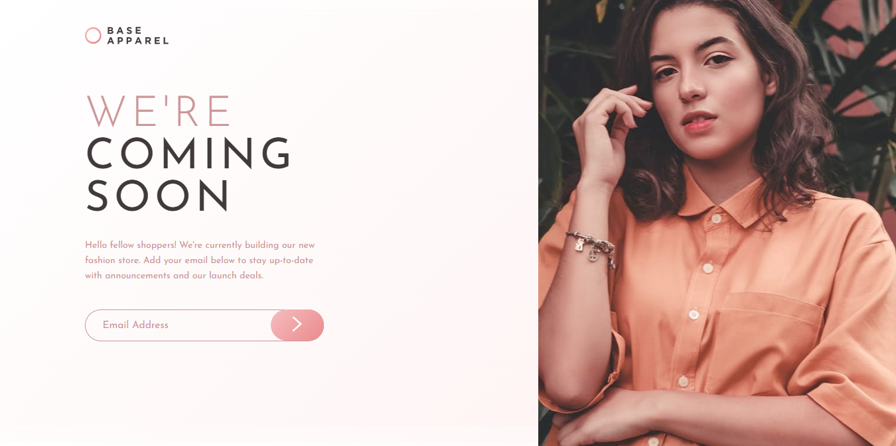
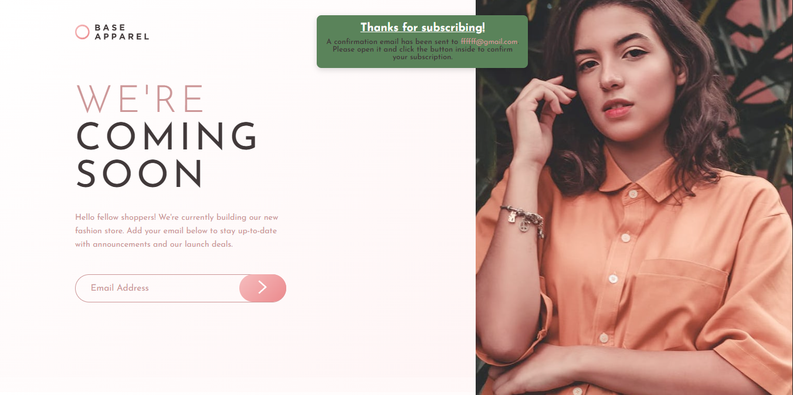

# Base Apparel coming soon page

### Desktop Result



### Desktop Active Result



# 📝 Descripción

> Este proyecto es una breve pagina informativa de Base Apparel que informa sobre una nueva tienda de moda online y da la posiblidad de poder anotarse mediante un formulario, todo se muestra de manera interactiva y completamente funcional. Está diseñada para ser completamente responsive, con diseños adaptados tanto para móviles como para escritorio.

## ✨ Características principales

- **Diseño responsive:** Compatible con móviles y escritorio.

- **Diseño Flexbox:** Optimizado para una visualización perfecta en desktop y mobile.

- **Uso de JavaScript:** Utiliza JavaScript para la utilizacion del input y que sea completamente funcional.

- **Visualización de la Pagina:** Cuenta con un Logo, un titulo, una descripcion, un formulario para anotar el correo electronico y un boton para enviar el correo.

- **Mensaje de Error e Icono:** Si el usuario no ingresa un correo electronico valido, se mostrara un mensaje de error y un icono de error.

## 🛠️ Tecnologías utilizadas

- **_HTML:_** Estructura semántica de la pagina.

- **_CSS:_** Estilos con Flexbox.

- **_JavaScript:_** Agrega funcionalidad al input.

- **_Google Fonts:_** Fuente _Josefin Sans_ para un diseño moderno.

- **_Git:_** Control de versiones.

- **_Formspree.io:_** Servicio para enviar correos.

## 🚀 Despliegue

> Este proyecto está desplegado en dos plataformas diferentes para que puedas acceder a él de manera fácil y rápida:

### 1. Netlify:

- El proyecto está alojado en Netlify, una plataforma moderna para aplicaciones web estáticas y dinámicas.

- Ver en Vivo: [Aqui](https://baseeapparell.netlify.app/)

## 🚀 Instalación

Sigue estos sencillos pasos para ejecutar el proyecto en tu entorno local:

1. **Clona este repositorio**:
   Abre tu terminal y ejecuta el siguiente comando:

   ```bash
   git clone https://github.com/ImBenja/Frontend-Challenges.git

   ```

2. **Navega al directorio del proyecto**:

   ```bash
   cd Frontend-Challenges/Newbie/Free/16-base-apparel-coming-soon-master

   ```

3. **Abre el archivo index.html en tu navegador**:
   Puedes hacerlo doble clic en el archivo o arrastrarlo a tu navegador.

## 💻 Uso

El componente funciona de la siguiente manera:

1. HTML, CSS y JavaScript.

2. Muestra la informacion en formato pagina completa.

3. Se adapta automáticamente a diferentes tamaños de pantalla.

4. Se puede enviar el correo electronico.

5. Funcionalidad del Formulario correctamente.

6. Mensaje de Error.

## 📷 Resultados

<table border="1">
  <tr>
     <th>
      Desktop View
    </th>
  </tr>
  <tr>
     <td>
      
    </td>
  </tr>
</table>

## 👨‍💻 Autor

- **_Benjamin Juarez_**

<a href= "https://www.instagram.com/benjajuarez1_/?hl=es">
    
</a>
<a href="https://www.frontendmentor.io/profile/ImBenja">
  
</a>
<a href="https://x.com/benjajuarez_2">
   
</a>
<a href="https://www.linkedin.com/in/benjam%C3%ADn-ju%C3%A1rez-b712592b8/">
	
</a>
