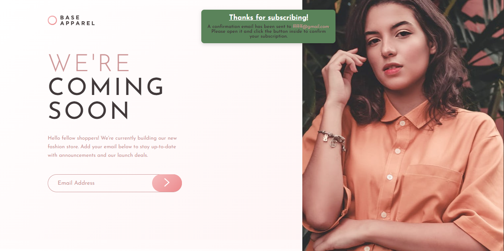

# Frontend - Base Apparel coming soon page solution

> Esta es mi solución al desafío **Base Apparel coming soon page solution** de Frontend Mentor. Los desafíos de Frontend Mentor te ayudan a mejorar tus habilidades de codificación mediante la construcción de proyectos realistas.

# 📖 Descripción general

### El desafío

Los usuarios deben poder:

1. Ver el diseño óptimo según el tamaño de pantalla de su dispositivo.

2. Ver los diseños flex-box y su estructura.

3. Ver la pagina con un mensaje de agradecimiento una vez enviado el correo.

4. Ver los mensajes de errores para poder guiarse en el formulario si algo se produce.

### Screenshot

#### Vista de escritorio




**Descripción**: Esta son las captura de pantalla de mi solución al desafío **Base Apparel coming soon page solution**. Muestra la vista de escritorio de el componente, con un diseño limpio.

### Links

- Solution URL: [**Solucion**](https://github.com/ImBenja/Frontend-Challenges/tree/main/Newbie/Free/16-base-apparel-coming-soon-master)
- Live Site URL: [**Sitio en Vivo**](https://baseeapparell.netlify.app/)

## 🛠️ Mi proceso

### Tecnologias utilizadas

- **_HTML:_** Estructura semántica de toda la informacion y el formulario.

- **_CSS:_** Estilos avanzados con flex-box.

- **_JavaScript:_** Funcionalidad para el input.

- **_Google Fonts:_** Fuente Josefin Sans para un diseño moderno.

- **_Formpree.io:_** Servicio de correo para enviar el formulario.

### Lo que Aprendi

1. _Manejo de Formulario_: Aprendi a manejar el formulario y enviar los datos a un servidor.

2. _Creacion de Formularios_: Aprendi a crear formularios y validarlos.

3. _Validacion de Formularios_: Aprendi a validar formularios y mostrar mensajes de error.

```js
document.addEventListener("DOMContentLoaded", function () {
  // Elementos del DOM
  const form = document.querySelector(".hero__form");
  const input = document.getElementById("email");
  const errorText = document.querySelector(".error-text");
  const errorIcon = document.querySelector(".error-icon");
  const submitButton = document.querySelector(".hero__button");
  const containerSubmit = document.querySelector(".container-submit");
  const textSubmit = document.querySelector(".text-email-submit");

  // Expresión regular mejorada para emails
  const emailRegex =
    /^[a-zA-Z0-9._%+-]+@[a-zA-Z0-9.-]+\.(com|org|net|edu|gov|ar|info)$/i;

  const allowedTLDs = ["com", "org", "net", "edu", "gov", "ar", "info"];
  // Función para validar el TLD
  function isValidTLD(tld) {
    return allowedTLDs.includes(tld);
  }

  // Variables para debounce
  let timeout;

  // Mostrar errores
  function showError(message) {
    errorText.textContent = message;
    errorText.classList.add("show");
    errorIcon.classList.add("show");
    input.classList.add("error");
    input.setAttribute("aria-invalid", "true");
  }

  // Resetear errores
  function resetErrors() {
    errorText.classList.remove("show");
    errorIcon.classList.remove("show");
    input.classList.remove("error");
    input.setAttribute("aria-invalid", "false");
  }

  // Validación del email
  function validateEmail(email) {
    if (!email) return { isValid: false, message: "Email cannot be empty" };
    if (!email.includes("@"))
      return { isValid: false, message: "Missing @ symbol" };
    if (email.split("@").length > 2)
      return { isValid: false, message: "Only one @ allowed" };
    if (!email.split("@")[1].includes("."))
      return { isValid: false, message: "Invalid domain format" };
    const tld = email.split(".")[1];
    if (!isValidTLD(tld)) return { isValid: false, message: "Invalid domain" };
    if (!emailRegex.test(email))
      return { isValid: false, message: "Please provide a valid email" };

    return { isValid: true, message: "" };
  }

  // Validación en tiempo real con debounce
  input.addEventListener("input", function () {
    clearTimeout(timeout);

    timeout = setTimeout(() => {
      const emailValue = input.value.trim();
      const validation = validateEmail(emailValue);

      if (emailValue === "") {
        resetErrors();
      } else if (!validation.isValid) {
        showError(validation.message);
      } else {
        resetErrors();
      }
    }, 500);
  });

  // Envío del formulario
  form.addEventListener("submit", function (e) {
    e.preventDefault();

    const emailValue = input.value.trim();
    const validation = validateEmail(emailValue);

    if (!validation.isValid) {
      showError(validation.message);
      input.focus();
    } else {
      resetErrors();

      setTimeout(() => {
        containerSubmit.classList.add("show");
        textSubmit.textContent = emailValue;

        // Ocultar después de 5 segundos
        setTimeout(() => {
          containerSubmit.classList.remove("show");
        }, 5000);
      }, 500);

      form.reset();
    }
  });
});
```

## 👨‍💻 Autor

- GitHub - [ImBenja](https://github.com/ImBenja)
- Frontend Mentor - [@ImBenja](https://www.frontendmentor.io/profile/ImBenja)
- Instagram - [@benjajuarez1\_](https://www.instagram.com/benjajuarez1_/?hl=es)
- Twitter - [@benjajuarez_2](https://x.com/benjajuarez_2)
- Linkedin - [Benjamim Juarez](https://www.linkedin.com/in/benjam%C3%ADn-ju%C3%A1rez-b712592b8/)

## 🙏 Agradecimientos

> Agradezco a Frontend Mentor por proporcionar este desafío y a la comunidad por su apoyo y feedback.
