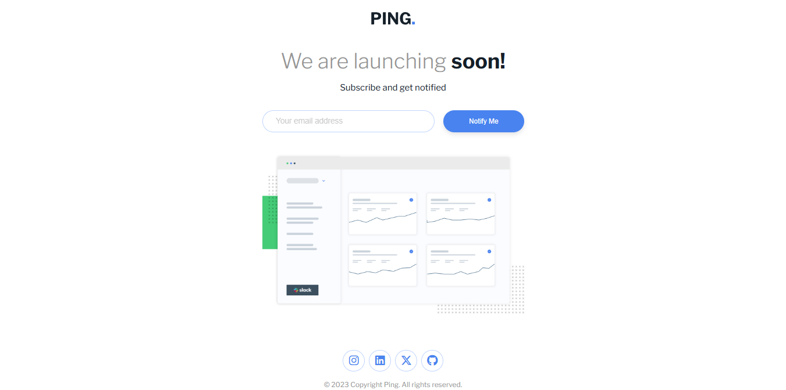
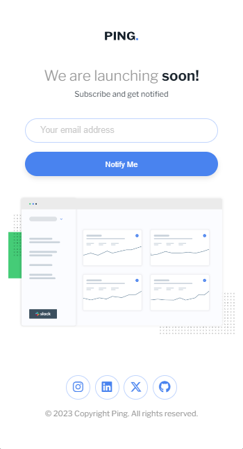

# Frontend - Ping coming soon page solution

> Esta es mi solución al desafío **Ping coming soon page solution** de Frontend Mentor. Los desafíos de Frontend Mentor te ayudan a mejorar tus habilidades de codificación mediante la construcción de proyectos realistas.

# 📖 Descripción general

### El desafío

Los usuarios deben poder:

1. Ver el diseño óptimo según el tamaño de pantalla de su dispositivo.

2. Ver los diseños flex-box y su estructura.

3. Ver la pagina con un mensaje de agradecimiento una vez enviado el correo.

4. Ver los mensajes de errores para poder guiarse en el formulario si algo se produce.

### Screenshot

#### Vista de escritorio

**Descripción**: Esta son las captura de pantalla de mi solución al desafío **Ping coming soon page solution**. Muestra la vista de escritorio de el componente, con un diseño limpio.

### Links

- Solution URL: [**Solucion**](https://github.com/ImBenja/Frontend-Challenges/tree/main/Newbie/Free/17-ping-coming-soon-page-master)
- Live Site URL: [**Sitio en Vivo**](https://pinng-pagee.netlify.app/)

## 🛠️ Mi proceso

### Tecnologias utilizadas

- **_HTML:_** Estructura semántica de toda la informacion y el formulario.

- **_CSS:_** Estilos avanzados con flex-box.

- **_JavaScript:_** Funcionalidad para el input.

- **_Google Fonts:_** Fuente Libre Franklin para un diseño moderno.

### Lo que Aprendi

1. _Manejo de Formulario_: Aprendi a manejar el formulario y enviar los datos a un servidor.

2. _Creacion de Formularios_: Aprendi a crear formularios y validarlos.

3. _Validacion de Formularios_: Aprendi a validar formularios y mostrar mensajes de error.

## 👨‍💻 Autor

- GitHub - [ImBenja](https://github.com/ImBenja)
- Frontend Mentor - [@ImBenja](https://www.frontendmentor.io/profile/ImBenja)
- Instagram - [@benjajuarez1\_](https://www.instagram.com/benjajuarez1_/?hl=es)
- Twitter - [@benjajuarez_2](https://x.com/benjajuarez_2)
- Linkedin - [Benjamim Juarez](https://www.linkedin.com/in/benjam%C3%ADn-ju%C3%A1rez-b712592b8/)

## 🙏 Agradecimientos

> Agradezco a Frontend Mentor por proporcionar este desafío y a la comunidad por su apoyo y feedback.
