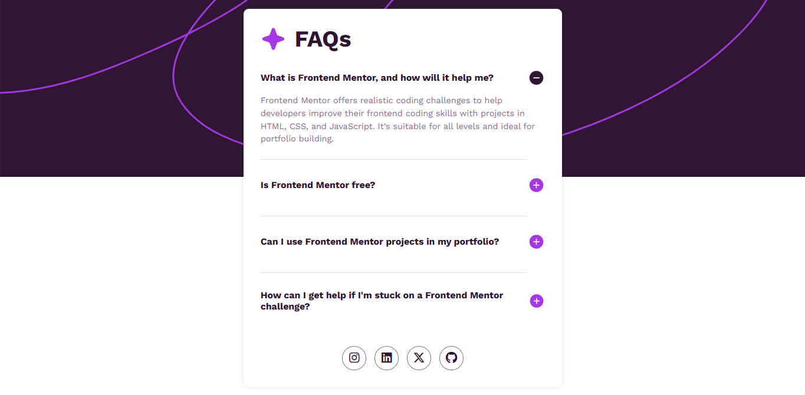

# Frontend Mentor - FAQ accordion solution

> Esta es mi solución al desafío **FAQ accordion solution** de Frontend Mentor. Los desafíos de Frontend Mentor te ayudan a mejorar tus habilidades de codificación mediante la construcción de proyectos realistas.

# 📖 Descripción general

### El desafío

Los usuarios deben poder:

1. Ver el diseño óptimo según el tamaño de pantalla de su dispositivo.

2. Ver los diseños flex-box y su estructura.

3. Ver cada pregunta frecuente.

4. Ver un acordion a la vez.

5. Hacer clic en una pregunta para ocultar o mostrar la respuesta.

### Screenshot

#### Vista de escritorio



**Descripción**: Esta son las captura de pantalla de mi solución al desafío **FAQ accordion solution**. Muestra la vista de escritorio de el componente, con un diseño limpio.

### Links

- Solution URL: [**Solucion**](https://github.com/ImBenja/Frontend-Challenges/tree/main/Newbie/Free/19-faq-accordion-main)
- Live Site URL: [**Sitio en Vivo**](https://faq-questions-mentor.netlify.app/)

## 🛠️ Mi proceso

### Tecnologias utilizadas

- **_HTML:_** Estructura semántica de todo el acordion.

- **_CSS:_** Estilos avanzados con flex-box.

- **_JavaScript:_** Funcionalidad para cada pregunta frecuente.

- **_Google Fonts:_** Fuente Work Sans para un diseño moderno.

### Lo que Aprendi

1. **Manejo de DOM**: Aprendí a manejar el DOM de forma efectiva para crear una experiencia de usuario interactiva.

2. **Mostrar preguntas**: Aprendí a mostrar y ocultar preguntas frecuentes utilizando JavaScript.

```js
const accordionHeaders = document.querySelectorAll(".accordion__header");
const panels = document.querySelectorAll(".panel");

// Inicializar el primer panel como abierto
panels[0].style.maxHeight = panels[0].scrollHeight + "px";
accordionHeaders[0].querySelector(".plus").style.display = "none";
accordionHeaders[0].querySelector(".minus").style.display = "block";

accordionHeaders.forEach((header, index) => {
  header.addEventListener("click", () => {
    const panel = panels[index];
    const plusIcon = header.querySelector(".plus");
    const minusIcon = header.querySelector(".minus");

    // Alternar el panel
    if (panel.style.maxHeight) {
      panel.style.maxHeight = null;
      plusIcon.style.display = "block";
      minusIcon.style.display = "none";
    } else {
      panel.style.maxHeight = panel.scrollHeight + "px";
      plusIcon.style.display = "none";
      minusIcon.style.display = "block";
    }

    // Cerrar otros paneles
    panels.forEach((otherPanel, otherIndex) => {
      if (otherIndex !== index) {
        otherPanel.style.maxHeight = null;
        accordionHeaders[otherIndex].querySelector(".plus").style.display =
          "block";
        accordionHeaders[otherIndex].querySelector(".minus").style.display =
          "none";
      }
    });
  });
});
```

## 👨‍💻 Autor

- GitHub - [ImBenja](https://github.com/ImBenja)
- Frontend Mentor - [@ImBenja](https://www.frontendmentor.io/profile/ImBenja)
- Instagram - [@benjajuarez1\_](https://www.instagram.com/benjajuarez1_/?hl=es)
- Twitter - [@benjajuarez_2](https://x.com/benjajuarez_2)
- Linkedin - [Benjamim Juarez](https://www.linkedin.com/in/benjam%C3%ADn-ju%C3%A1rez-b712592b8/)

## 🙏 Agradecimientos

> Agradezco a Frontend Mentor por proporcionar este desafío y a la comunidad por su apoyo y feedback.
